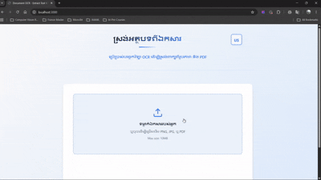

# Document Text Extraction System 

A Document Processing, OCR (Optical Character Recognition) application for extracting text from images and PDFs. Built with Next.js frontend and FastAPI backend using Chrome-Lens-Py for English and Khmer support.

## Demo

<p align="center">
  
</p>

## 📋 About

**This project** is a document processing system designed to extract text from images and PDF files with high accuracy. The main purpose is focusing on Khmer language OCR while supporting multiple other languages. The system provides a clean REST API backend and modern web interface for seamless document processing.

**Next Step:** We also plan to fine-tune our own Khmer OCR model for Khmer Language Specification and run it on local to prevent some sensitive documents, then we deploy on web interfaces.

## Objectives

- A fresh start with OCR by using Chrome-lens-py for document extraction
- Deploy locally on web interface using next.js, and FastAPI
- Extract text from images (PNG, JPG, JPEG) and PDF files with high accuracy
- Support multiple languages including Khmer, English, Japanese, and more
- Provide a user-friendly web interface for document uploads and processing
- Offer a robust REST API for programmatic integration
- Enable easy export and formatting of extracted text
- Maintain production-grade code quality and reliability

## 💻 Tech Stack

### Backend
- **Python 3.14+** - Core runtime environment
- **FastAPI 0.115.5+** - Modern async web framework
- **Uvicorn** - ASGI server
- **Chrome Lens API (chrome-lens-py)** - Advanced OCR engine with multi-language support
- **pdfplumber 0.11.9+** - PDF text extraction
- **Gunicorn** - Production WSGI server

### Frontend
- **Next.js** - React-based web framework
- **TypeScript** - Type-safe JavaScript
- **Tailwind CSS** - Utility-first styling
- **Responsive Design** - Mobile and desktop support

### DevOps
- **Docker & Docker Compose** - Containerization
- **uv** - Fast Python package manager (recommended)
- **Git** - Version control

## 🔄 Workflow

1. **User uploads document** → Frontend sends file to API
2. **Backend validates** → Checks file type and size
3. **OCR Processing** → Chrome Lens API extracts text
4. **Text Formatting** → Structured output with metadata
5. **Display Results** → Frontend shows extracted text
6. **Export Options** → Download or copy text

## 🏗️ Project Structure

```
OCR/
├── ocr_app/                 # FastAPI
│   ├── app.py              # Main 
├── core/
│   └── ocr_demo_v1.py      # OCR 
├── frontend/               # Next.js
│   ├── pages/
│   ├── components/
│   ├── styles/
│   └── public/
├── pyproject.toml         
├── requirements.txt        
├── docker-compose.yml      
├── Dockerfile             
├── LICENSE                
└── README.md             
```

## 🚀 Getting Started

### Option 1: Local Setup with uv (Recommended)

#### 1. Clone and navigate to project
```bash
cd OCR
```

#### 2. Setup Python Backend
```bash
# Create virtual environment with uv (fastest)
uv venv

# Activate virtual environment
# Windows PowerShell:
.\.venv\Scripts\Activate.ps1

# macOS/Linux:
source .venv/bin/activate
```

#### 3. Install dependencies
```bash
# Using uv (fastest)
uv pip install -r requirements.txt

# Or use pip
pip install -r requirements.txt
```

#### 4. Start FastAPI backend
```bash
python -m uvicorn ocr_app.app:app --reload
```
Backend runs at: `http://localhost:8000`

#### 5. In a new terminal, setup frontend
```bash
cd frontend
npm install
npm run dev
```
Frontend runs at: `http://localhost:3000`

#### 6. Open in browser
Navigate to `http://localhost:3000` and start uploading documents.

---

### Option 2: Local Setup with pip (Standard)

#### 1. Clone and navigate to project
```bash
cd OCR
```

#### 2. Create virtual environment
```bash
# Windows PowerShell:
python -m venv .venv
.\.venv\Scripts\Activate.ps1

# macOS/Linux:
python3 -m venv .venv
source .venv/bin/activate
```

#### 3. Install dependencies
```bash
pip install -r requirements.txt
```

#### 4. Start FastAPI backend
```bash
python -m uvicorn ocr_app.app:app --reload
```

#### 5. In a new terminal, setup frontend
```bash
cd frontend
npm install
npm run dev
```

#### 6. Access application
Open `http://localhost:3000`

---

### Option 3: Docker (Easiest)

#### 1. Build and run with Docker Compose
```bash
docker-compose up --build
```

#### 2. Access the application
- Frontend: `http://localhost:3000`
- Backend API: `http://localhost:8000`

#### 3. Stop containers
```bash
docker-compose down
```

---

## 📖 Usage

### Web Interface
1. Navigate to `http://localhost:3000`
2. Click "Upload Document"
3. Select an image (PNG, JPG, JPEG) or PDF file
4. Click "Process"
5. View extracted text in the results panel
6. Copy or download the text

### REST API
```bash
# Upload and process document
curl -X POST "http://localhost:8000/api/ocr" \
  -F "file=@document.jpg"

# Response:
{
  "success": true,
  "text": "Extracted text here...",
  "filename": "document.jpg",
  "processing_time": 2.34,
  "file_size_kb": 245.5
}
```

### API Endpoints

| Endpoint | Method | Description |
|----------|--------|-------------|
| `/api/ocr` | POST | Process document and extract text |
| `/health` | GET | Health check endpoint |
| `/` | GET | Web UI (legacy) |

---

## 🎓 Learn More

- [Chrome Lens API Documentation](https://github.com/bropines/chrome-lens-py)
- [FastAPI Documentation](https://fastapi.tiangolo.com/)
- [Next.js Documentation](https://nextjs.org/docs)
- [Docker Documentation](https://docs.docker.com/)


## 📚 API Documentation

### Upload and Process Document

**Endpoint**: `POST /api/ocr`

**Frontend route**: `POST /frontend/api/ocr`

**Request**:
```bash
curl -X POST http://localhost:8000/api/ocr \
  -F "file=@document.png" \
  -F "language=en"
```

**Response**:
```json
{
  "success": true,
  "text": "Extracted text content...",
  "filename": "document.png",
  "processing_time": 2.5,
  "confidence": 0.92
}
```

## 🎯 Supported File Types

| Format | Max Size | Notes |
|--------|----------|-------|
| PNG    | 10 MB    | Lossless, recommended |
| JPG/JPEG | 10 MB  | Compressed format |
| PDF    | 20 MB    | Multi-page support |


